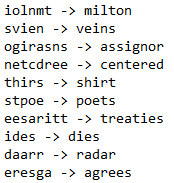
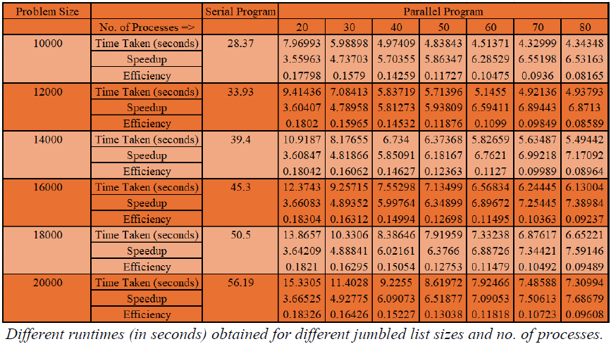
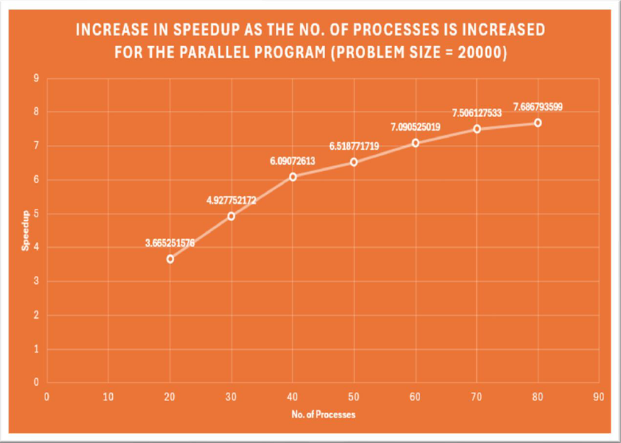

# Accelerated Word Jumble Solver with Parallel Computing
- Employed a parallel programming approach using MPI with C++ to extract meaningful words from a large, jumbled set to improve efficiency against conventional serial programming. 
- Performed comparative analysis to determine a reduction of approximately 85% in the time taken by using 80 processes for a problem size of 20,000 words.

## Results

